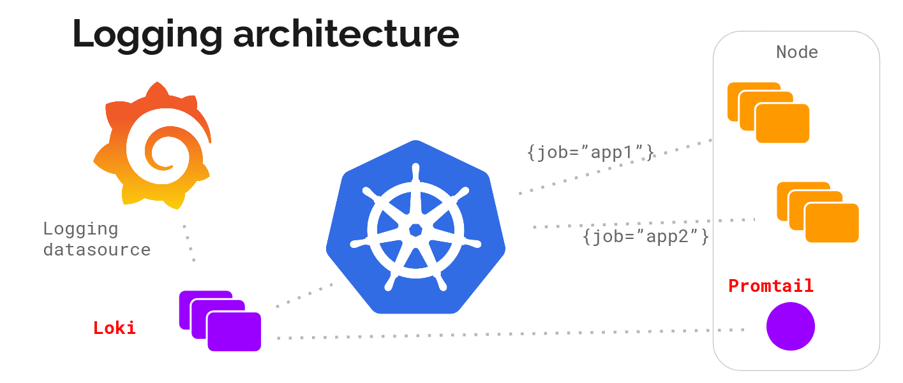
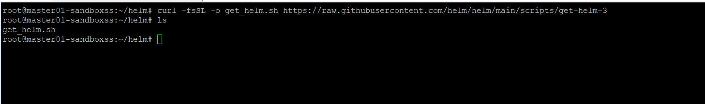
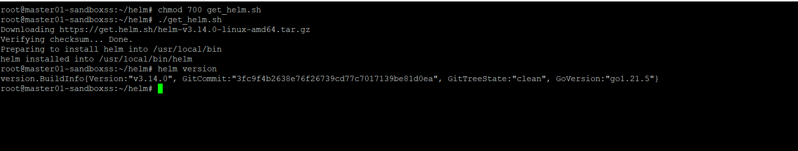
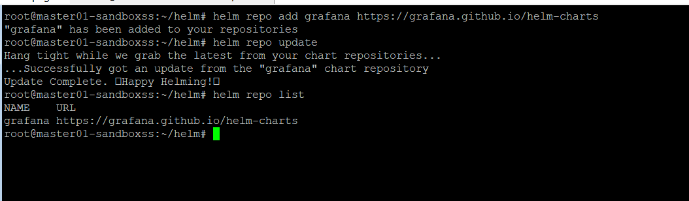
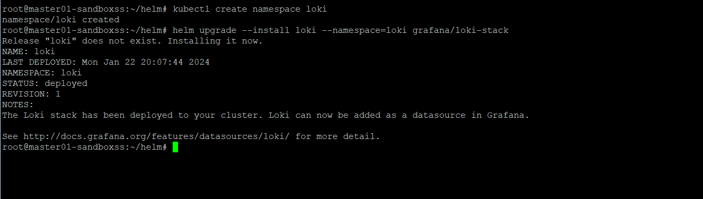
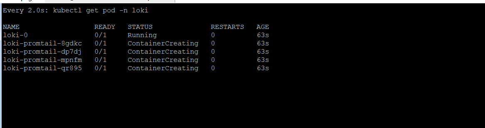
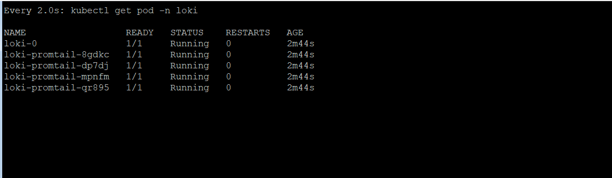

# setup loki using helm for kubernetes onpremise
setup loki using helm for k8s on premise


# Components <br />
**Loki:** The main server component is called Loki. It is responsible for permanently storing the logs it is being shipped and it executes the LogQL queries from clients. Loki shares its high-level architecture with Cortex, a highly scalable Prometheus backend. <br />
**Promtail:** To ship logs to a central place, an agent is required. Promtail is deployed to every node that should be monitored and sends the logs to Loki. It also does important task of pre-processing the log lines, including attaching labels to them for easier querying. <br />
**Grafana:** The Explore feature of Grafana 6.0+ is the primary place of contact between a human and Loki. It is used for discovering and analyzing logs. <br />

## Install Helm on your cluster
1. download binary helm
```bash 
mkdir helm
cd helm
curl -fsSL -o get_helm.sh https://raw.githubusercontent.com/helm/helm/main/scripts/get-helm-3
ls
```

2. install binary helm using /bin/bash
```bash
chmod 700 get_helm.sh
./get_helm.sh
helm version
```


## Add repository loki using helm chart
```bash
    helm repo add grafana https://grafana.github.io/helm-charts
helm repo update
helm repo list
```


## Deploy Loki and Promtail to your cluster with default value and custome namespace
1. create namespace loki on your cluster
```bash
kubectl create namespace loki
```
2. deploy loki and promtail to loki namespace
```bash
helm upgrade --install loki --namespace=loki grafana/loki-stack
```


3. watch and wait a view minutes pod loki and promtail is creating
```bash
watch kubectl get pod -n loki
```


all pod will up about 2 minutes

**note:** <br />
loki-0 : The main server component <br />
loki-promtail-xxx : agent for share log to loki main server


